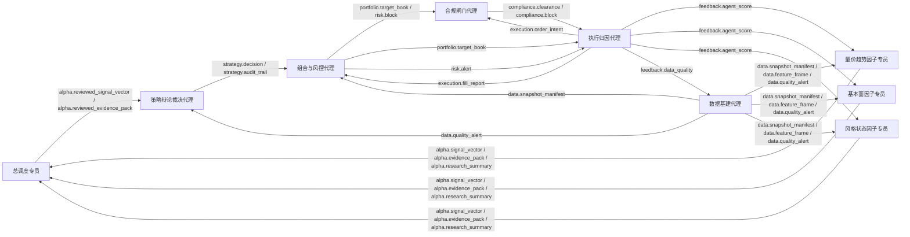

# 量化代理矩阵

本文档把机构级“五环多核”架构降级为 StarBridge Quant 当前可落地的本地形态：Windows 侧继续只做 QMT 网关和交易执行，WSL 侧承载研究、信号、组合、风控与复盘。矩阵只专注 A 股，不引入股指期货对冲，不把高频机构执行体系照搬进来。

## 设计边界

- 代理数量：8 个业务代理 + 1 个总调度专员，总数固定不超过 9。
- 标的范围：A 股股票池优先；ETF 可以作为研究参考，默认不进入本矩阵的对冲执行路径。
- 频率约束：低频/中频优先，盘中只做数据异常、风控、执行节奏和成交反馈。
- QMT 定位：数据主源、账户查询、委托执行和成交回报网关；不在服务端内嵌复杂策略。
- 合规边界：实盘下单必须通过组合风控与合规闸门；股指期货、期权、融资融券默认不进入该矩阵执行链路。

## 代理职责

| 代理 | 由机构级架构降级而来 | 核心输出 |
|------|----------------------|----------|
| 总调度专员 | 全局 Orchestrator | 任务上下文、运行状态、审核后的 Alpha 汇总 |
| 数据基建代理 | 市场数据、另类数据、特征工程 | 研究快照、特征表、数据质量告警 |
| 量价趋势因子专员 | 技术面、量价、微观结构分析师 | 量价信号、证据包、研究摘要 |
| 基本面因子专员 | 基本面、财务、估值分析师 | 基本面信号、证据包、研究摘要 |
| 风格状态因子专员 | 宏观状态、行业轮动、情绪分析师 | 风格状态信号、证据包、研究摘要 |
| 策略辩论裁决代理 | 多头、空头、法官三代理 | Buy/Hold/Sell、置信度、审计轨迹 |
| 组合与风控代理 | 组合经理、实时风控 | 目标持仓、T+1 锁定池、风险拦截 |
| 合规闸门代理 | 程序化交易合规 | 放行/拒绝、频率限制、权限检查 |
| 执行归因代理 | 执行交易员、投后归因 | 订单意图、成交报告、滑点与代理贡献反馈 |

## 通信链路

所有代理通过黑板主题通信，代码定义在 `research/agents/matrix.py`。黑板实现会拒绝未声明的捷径，例如 Alpha 研究代理不能绕过策略、风控、合规直接触发执行。



## 使用方式

查看当前矩阵：

```bash
just agent-matrix
just agent-matrix --format json
just agent-matrix --format mermaid
```

在研究代码里使用：

```python
from research.agents import AgentBlackboard, build_default_quant_agent_matrix

matrix = build_default_quant_agent_matrix()
assert not matrix.validate()

blackboard = AgentBlackboard(matrix)
blackboard.publish(
    source="data_steward",
    target="alpha_analyst",
    topic="data.snapshot_manifest",
    payload={"snapshot_id": "20260424_research", "asof_date": "20260424"},
)
```

## Codex Subagents

仓库内 `.codex/subagents/` 已按矩阵节点配置 9 个可调用子代理：

| 矩阵节点 | Codex subagent |
|----------|----------------|
| `supervisor` | `quant-matrix-supervisor` |
| `data_steward` | `quant-data-specialist` |
| `alpha_analyst` | `quant-factor-specialist` |
| `alpha_fundamental_analyst` | `quant-factor-fundamental-specialist` |
| `alpha_style_analyst` | `quant-factor-style-specialist` |
| `strategy_debate_judge` | `quant-strategy-debate-judge` |
| `portfolio_risk` | `quant-portfolio-risk-specialist` |
| `compliance_gatekeeper` | `quant-compliance-gatekeeper` |
| `execution_attribution` | `quant-execution-attribution-specialist` |

其中 `quant-data-specialist` 和 `quant-factor-specialist` 复用了原有的量化数据专员、量化因子专员；新增的基本面因子专员与风格状态因子专员用于并行研究，三条因子线统一回传总调度专员审核。

## 落地顺序

1. 数据基建代理先固化研究快照和行业映射，保证任何因子实验可复现。
2. 三位因子专员并行研究量价、基本面、风格状态，只把结果回传总调度。
3. 总调度专员审核三条因子线的共识、冲突、数据质量和可交易性，再输出 reviewed Alpha。
4. 策略辩论裁决代理把多头、空头、裁决压缩为单代理内部状态机，减少外部代理数量。
5. 组合与风控代理把建议转成目标持仓，并显式处理 T+1、集中度、流动性和现金约束。
6. 合规闸门代理统一检查实盘授权、API Key、频率阈值和 A 股执行范围。
7. 执行归因代理负责订单节奏、成交记录、滑点归因，并把反馈写回 Alpha 和数据代理。
